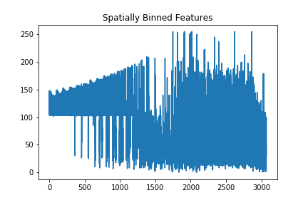

## Writeup

---

**Vehicle Detection Project**

The goals / steps of this project are the following:

* Perform a **Histogram of Oriented Gradients (HOG)** feature extraction on a labeled training set of images and train a classifier **Linear SVM classifier**
* Optionally, you can also apply a **color transform** and append binned color features, as well as histograms of color, to your HOG feature vector. 
* Note: for those first two steps don't forget to normalize your features and randomize a selection for training and testing.
* Implement a **sliding-window technique** and use your trained classifier to search for vehicles in images.
* Run your pipeline on a video stream (start with the test_video.mp4 and later implement on full project_video.mp4) and create a heat map of recurring detections frame by frame to reject outliers and follow detected vehicles.
* Estimate a bounding box for vehicles detected.

[//]: # (Image References)

[image2]: ./examples/HOG_example.jpg
[image3]: ./examples/sliding_windows.jpg
[image4]: ./examples/sliding_window.jpg
[image5]: ./examples/bboxes_and_heat.png
[image6]: ./examples/labels_map.png
[image7]: ./examples/output_bboxes.png
[video1]: ./project_video.mp4

## [Rubric](https://review.udacity.com/#!/rubrics/513/view) Points
### Here I will consider the rubric points individually and describe how I addressed each point in my implementation.  

---
### Feature extraction

#### 1. Histograms of Color

The code for this step is contained in the 1~12 code cell of the IPython notebook (the file called `P5-Vehicle-Detection.ipynb`).  

우선 'vehicle'과 'non-vehicle' 이미지를 읽어보는 과정을 수행했습니다.
아래 그림은 'vehicle'과 'non-vehicle'의 classes 예시입니다.
(64x64 size)

<center></center>

Color space을 변경하는 과정을 수행했습니다.

우선 주어진 test 이미지 12개에 대해 RGB 영상의 histogram 을 plot 해보았습니다.

<center></center>

ColorSpace1 의 car 이미지와 ColorSpace6의 배경 이미지가 크게 차이가 없는 것을 볼 수 있습니다. 

따라서 더 좋은 결과를 위해서 color sapce 을 변경 할 필요가 있다고 판단 했습니다.

어떤 color sapce로 변경하면 좋을지 판단하기 위해 여러 가지 plot 을 하여 car의 특징이 잘 categorization 되어 있는 color space 을 눈으로 찾아보았습니다.

color space는 차례로 RGB, HSV, LUV, HLS, YUV 순으로 출력했습니다.

<center></center>


<center></center>


#### 2. Spatial Binning of Color
color 외에도 RAW 데이터 자체 값들도 좋은 feature 요소입니다.

하지만 모든 값을 그대로 feature에 넣기에는 데이터 양이 너무 많고

window 크기에 따라 영향을 많이 받게 됩니다.

이러한 부분을 해결하기 위해 데이터 자체를 resize 하여 개형만을 갖게하고

이를 feature로 축출하게 됩니다.

아래는 64x64의 입력 데이터를 `bin_spatial` 8 code cell of the IPython notebook (the file called `P5-Vehicle-Detection.ipynb`)을 이용하여 32x32로 줄인 후 일렬로 출력한 feature 값 입니다.
(32x32x3:channel수=3072)

<center></center>


#### 3. Histogram of Oriented Gradients (HOG)
HOG 과정에 대해 설명드리겠습니다.
우선, 일반적인 차의 gradient 그림은 아래와 같이 주어질 때,
<center></center>

이를 일부 gorup으로 나누면 아래와 같이 구성됩니다. (8x8)
<center></center>

확대 하면 아래와 같이 group내 각 pixel의 grdient로 구성되어 있는 것을 알 수 있습니다.
<center></center>

해당 group의 vector로 표시하면 아래와 같이 표시 됩니다.
<center></center>

<center></center>

<center></center>

최종적으로 HOG feature을 보면 아래와 같이 구성됩니다.
<center></center>

이와 같은 방식으로 구성한 feature을 HOG feature라 하고 

가장 특징적인 부분은 그룹에 vector가 큰 값에 dominant 하게 영향을 받기 때문에 noise의 영향을 적게 받는 다는 점 입니다.

`skimage.hog()` 함수를 살펴보면 parameters는 `orientations`, `pixels_per_cell`, and `cells_per_block` 이 존재해서 이를 tuning이 필요한데 이 부분은 아직 진행하지 못했습니다.

실제 결과를 보여드리기 위해 car classes 영상에 대한 `skimage.hog()` 결과를 보여드리겠습니다
 
 우선 RGB 영상에 대해 수행했고 HOG parameter는 아래와 같이 지정하였습니다.
 `orientations=9`, `pixels_per_cell=(8, 8)`, `cells_per_block=(2, 2)`

<center></center>


#### 2. Describe how (and identify where in your code) you trained a classifier using your selected HOG features (and color features if you used them).

 linear SVM 에 입력 데이터를 넣기 전에 feature에 대해 normalization 작업을 수행했습니다. (T.B.D.)
```python
 # Create an array stack of feature vectors
X = np.vstack((car_features, notcar_features)).astype(np.float64)   

# Fit a per-column scaler
X_scaler = StandardScaler().fit(X)

# Apply the scaler to X
scaled_X = X_scaler.transform(X)
```

<center></center>


### Sliding Window Search

#### 1. Describe how (and identify where in your code) you implemented a sliding window search.  How did you decide what scales to search and how much to overlap windows?

이제 실제 카메라 영상에 차량을 판단하기 위해서는 window을 sliding 하며 실제 차량이 있는 부분을 찾아야합니다.
<center></center>

하지만 실제 영상에서는 원근법에 의해서 차량의 window가 위치에 따라 크기가 달라질 필요가 있습니다.

<center></center>

<center></center>

(구현 T.B.D.)

#### 2. Show some examples of test images to demonstrate how your pipeline is working.  What did you do to optimize the performance of your classifier?


처음 시도 시에는 HSV나 다른 color space에서 한 채널(ex H channel)만 이용하는 것이 물체를 구별할 떄 좋게 작용할 것으로 예상했습니다.

그러나 RBG, HSV, LUV, YCrCb를 수행해볼 때, 한 채널만을 이용하여 feature 을 축출하는 것 보다 모든 채널을 이용하는 것이 더 높은 정확도를 갖아 `'ALL'` 로 파라미터를 고정하였습니다.

color space는 그 중 가장 정확도가 높게 측정된 LUV를 사용하였습니다.

아래는 이를 이용한 예시 그림 입니다.

<center></center>
---

### Video Implementation

#### 1. Provide a link to your final video output.  Your pipeline should perform reasonably well on the entire project video (somewhat wobbly or unstable bounding boxes are ok as long as you are identifying the vehicles most of the time with minimal false positives.)
최종 결과 영상은 아래 링크에 있습니다.

[link to my video result](./output_images/project_video.mp4)


#### 2. Describe how (and identify where in your code) you implemented some kind of filter for false positives and some method for combining overlapping bounding boxes.

I recorded the positions of positive detections in each frame of the video.  From the positive detections I created a heatmap and then thresholded that map to identify vehicle positions.  I then used `scipy.ndimage.measurements.label()` to identify individual blobs in the heatmap.  I then assumed each blob corresponded to a vehicle.  I constructed bounding boxes to cover the area of each blob detected.  

Here's an example result showing the heatmap from a series of frames of video, the result of `scipy.ndimage.measurements.label()` and the bounding boxes then overlaid on the last frame of video:

### Here are 1 frames and their corresponding heatmaps:

<center></center>

### Here is the output of `scipy.ndimage.measurements.label()` on the integrated heatmap from all six frames:
<center></center>


### Here the resulting bounding boxes are drawn :

<center></center>
<center></center>
<center></center>
<center></center>
<center></center>
<center></center>


---

### Discussion

#### 1. Briefly discuss any problems / issues you faced in your implementation of this project.  Where will your pipeline likely fail?  What could you do to make it more robust?

False positive 을 줄이는 과정이 중요합니다.

하지만 threshold 을 너무 낮추면 차량이 존재해도 찾지 못하는 경우가 발생할 수 도 있습니다.

이 때, 앞선 line detection 처럼 영상의 이미지에서 line을 찾을 때 기존에 찾은 line의 정보를 이용하여 예측하게 되면 어느 정도 신뢰성 있는 결과를 얻을 수 있는 것을 배웠습니다.

이 과정을 일부 적용하기 위해 udacity 리뷰의 아래와 같은 코멘트를 참고하였습니다.

```(python)
# Create deque for caching 10 frames
from collections import deque
cache = deque(maxlen=10)
(...)

# Find boxes on each scale, simplified
boxes = find_cars(img, scale)
heat = add_heat(heat, boxes)

# Add current heatmap to cache
cache.append(heat)

# Accumulate heatmaps for thresholding, might use average as well
heat = np.sum(cache, axis=0)

# Apply a larger threshold as heat from cars should dominate
heat = apply_threshold(heat, 8)
(...)
```
FIFP 메모리를 하나 선언하여 얻을 box 값을을 채워 넣고 

해당 FIFO의 sum 값을 heat 함수에 넣으면 정말로 차량이 존재하는 부분에서는 많은 heat 값들이 return 될 것입니다.

따라서 threshold를 높힐수 있는 근거가 되고 이렇게 구성할 경우

False negative을 줄일 수 있게 됩니다.
